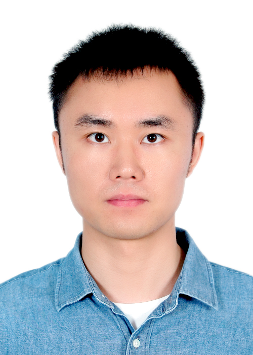

## Jiamin Chen

   

### About me
***
I am currently a PhD student at Central South University(CSU). I received the master's and bachelor's degree from Nanchang University(NCU). My reserach interests are the Deep Learning and the Automatic Machine Learning on Graph.

Email: chenjiamin@csu.edu.cn

### Educations
***
* **Central South University** PhD in Computer Science and Technology, from September 2020 to June 2024(Expected).
  
* **Nanchang University** M.S. in Radio Physics, from September 2014 to June 2017.

* **Nanchang University** B.S. in Applied Physics, from September 2010 to June 2014.
  
### Experiences
***
* **Zhejiang Mobile Communication Company** Machine Learning Algorithm Engineer, from June 2017 to July 2020.
   
   
### Publications
***

* **Auto-GNAS: A Parallel Graph Neural Architecture Search Framework.**   **Jiamin Chen**, Jianliang Gao, Yibo Chen, Babatounde MOCTARD Oloulade, Tengfei Lyu, Zhao Li (TPDS 2022,CCF-A). [Paper](https://ieeexplore.ieee.org/document/9714826) [Code](https://github.com/AutoMachine0/Auto-GNAS)
* **Identification of new M 31 star cluster candidates from PAndAS images using convolutional neural networks.**   Shoucheng Wang, Bingqiu Chen, Jun Ma, Qian Long, Haibo Yuan, Dezi Liu, Zhimin Zhou, Wei Liu, **Jiamin Chen**, Zizhao He (A&A 2022,JCR-Q1). [Paper](https://www.aanda.org/articles/aa/abs/2022/02/aa42169-21/aa42169-21.html) [Code](https://github.com/wscdaxia/coreCode_cnn)
* **Multi-label Metabolic Pathway Prediction with Auto Molecular Structure Representation Learning.**   **Jiamin Chen**, Jianliang Gao, Tengfei Lyu, Babatounde MOCTARD Oloulade, Xiaohua Hu (BIBM 2021,CCF-B). [Paper](https://ieeexplore.ieee.org/abstract/document/9669309) [Code](https://github.com/AutoMachine0/Auto-MSR)
* **Graph neural architecture search: A survey.**   Babatounde Moctard Oloulade, Jianliang Gao, **Jiamin Chen**, Tengfei Lyu, Raeed Al-Sabri (TST 2021,JCR-Q1). [Paper](https://ieeexplore.ieee.org/document/9645440/authors#authors)
* **GraphPAS: Parallel Architecture Search for Graph Neural Networks.**   **Jiamin Chen**, Jianliang Gao, Yibo Chen, Babatounde MOCTARD Oloulade, Tengfei Lyu, Zhao Li (SIGIR 2021,CCF-A). [Paper](https://dl.acm.org/doi/abs/10.1145/3404835.3463007) [Code](https://gitee.com/ncucjm/GraphPAS)
* **Impact of Reentry Speed on the Transmission of Obliquely Incident THz Waves in Realistic Plasma Sheaths.**   Kai Yuan, **Jiamin Chen**, Linfang Shen, Xiaohua Deng, Ming Yao, Lujun Hong (TPS 2018,JCR-Q2). [Paper](https://ieeexplore.ieee.org/document/8262626)
* **Studies of Terahertz Wave Propagation in Realistic Reentry PlasmaSheath.**   **Jiamin Chen**, Kai Yuan, Linfang Shen, Xiaohua Deng, Lujun Hong, Ming Yao (PIER 2016,JCR-Q2). [Paper](https://www.jpier.org/pier/pier.php?paper=16061202)
